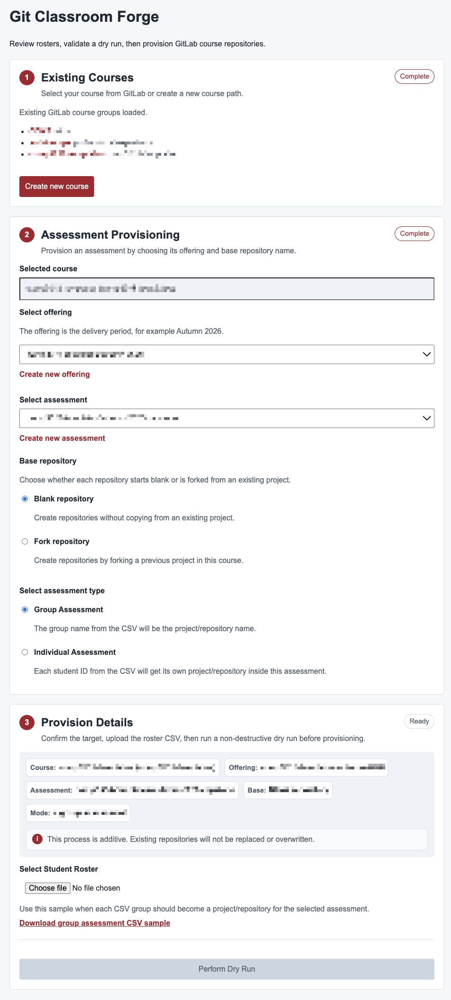

# Git Classroom Forge

Git Classroom Forge is an internal Docker-hosted tool for helping teaching staff validate
and provision GitLab and GitHub assignment repositories at scale.

The app provides a Flask workflow for reviewing roster CSV inputs, running a
non-destructive dry run, and then provisioning the reviewed GitLab & GitHub projects,
forks, memberships, and invitations.

Note: GitHub Provisioning still in the works

## Roadmap

- [x] GitLab Provisioning
- [ ] GitHub Provisioning

## Loading the System

The development workflow is Docker-first. You need Docker running locally before
starting the app.

1. Create local environment files:

   ```bash
   scripts/dev init
   ```

   This creates `.env` from `.env.example` if `.env` does not already exist, and
   creates `.docker/local.env` for the local Docker project name and port.

2. Edit `.env` and set the GitLab connection values:

   ```env
   GITLAB_URL="https://gitlab.example.edu.au"
   GITLAB_TOKEN="your_gitlab_token_here"
   ```

   The app can load without a token, but browsing GitLab groups, running dry runs,
   and provisioning require both `GITLAB_URL` and `GITLAB_TOKEN`.

3. Start the app:

   ```bash
   scripts/dev up
   ```

   The command prints the local app URL, usually `http://127.0.0.1:8080`.
   Open that URL in a browser. The landing page lets you choose GitLab
   provisioning; GitHub is shown as a future option.

4. Stop the app when finished:

   ```bash
   scripts/dev down
   ```

## Configuration

Copy or generate `.env` from `.env.example`, then edit `.env` for your local
deployment. Do not commit `.env`; it may contain a GitLab token.

Required for GitLab-backed validation and provisioning:

- `GITLAB_URL`: Base URL for the GitLab instance.
- `GITLAB_TOKEN`: Personal, project, or service token with enough permission to
  read course groups and provision groups, projects, forks, memberships, and
  invitations.

Useful defaults:

- `APP_ENV`: Runtime environment label. Leave as `development` for local work.
- `APP_HOST`: Container bind address. Leave as `0.0.0.0` for Docker.
- `APP_PORT`: Flask port inside the container. The host port is managed by
  `scripts/dev`.
- `DATA_DIR`: Generated uploads, reports, and logs directory inside the
  container.
- `STUDENT_EMAIL_DOMAIN`: Domain used when deriving student invitation email
  addresses from student IDs.

If the persisted local port is unavailable, run:

```bash
scripts/dev init --reset
```

Then start the app again with `scripts/dev up`.

## CSV Formats

Group-based projects:

```csv
project_path,project_name,student_id
team-01,PA2601 Team 01,22048668
team-01,PA2601 Team 01,22049321
team-01,PA2601 Team 01,22050119
team-02,PA2602 Team 02,22051234
team-02,PA2602 Team 02,22054567
team-02,PA2602 Team 02,22057890
```

Individual projects:

```csv
student_id,project_path,project_name
22048668,22048668,John Doe - 22048668
22049321,22049321,Jane Doe - 22049321
```

## Local Checks

```bash
python -m compileall app
pytest
```

Or run the Docker-backed check:

```bash
scripts/dev check
```

## Generated Data

Generated uploads, reports, and audit logs live under `data/`. Directory placeholders
are committed, but generated contents are ignored by git.

## A Simplistic UI

